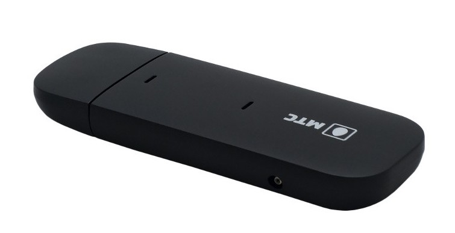
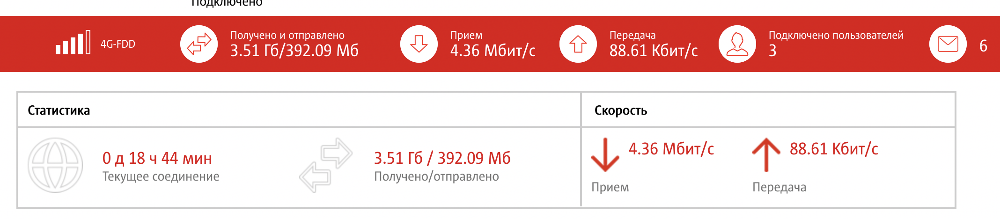
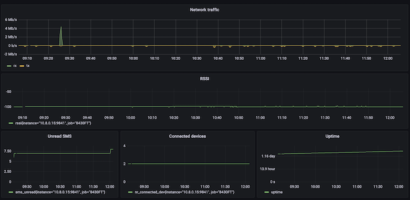

[](https://travis-ci.com/dernasherbrezon/8430ft_exporter) [](https://sonarcloud.io/dashboard?id=dernasherbrezon_8430ft_exporter)

# 8430ft_exporter

This repository contains metrics exporter to [Prometheus](https://prometheus.io) for 8430FT modem. 8430FT is a 3G/4G modem widely used by MTS. It can act as a normal USB modem or can be WiFi access point.



By default 8430FT exports all monitoring information via its own WEB UI. 



This is OK for small deployments, but getting harder to control and monitor on a larger scale. 8430ft_exporter project allows export such information into [Prometheus](https://prometheus.io) where it can be aggregated from hundreds of other modems.


## Build

In order to build the project simply execute:

```
mvn clean package
```

## Run

Edit sample configuration at ```./src/main/resources/config.properties``` and run using the following command:

```
java -jar ./target/8430ft_exporter.jar ./src/main/resources/config.properties 
```

## Run as a service

1. Modify ```./src/main/resources/8430ft_exporter.service``` file
2. Copy this file:

```
sudo cp ./src/main/resources/8430ft_exporter.service /etc/systemd/system/
```

3. Enable the service:

```
sudo systemctl enable 8430ft_exporter.service
```

4. Start the service:

```
sudo systemctl start 8430ft_exporter.service
```

## Prometheus configuration

```
  - job_name: '8430FT'
    static_configs:
      - targets: ['<ip address of 8430ft_exporter>:9841']
```

